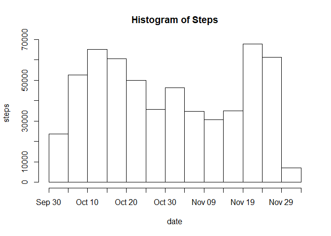
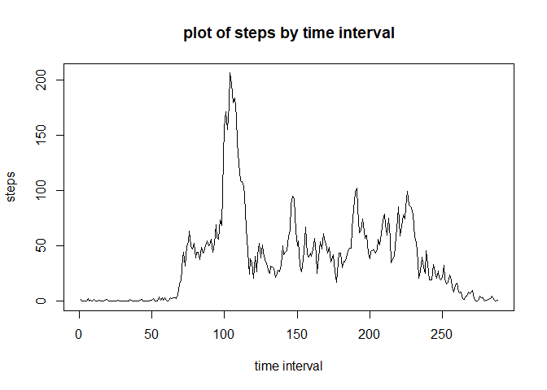
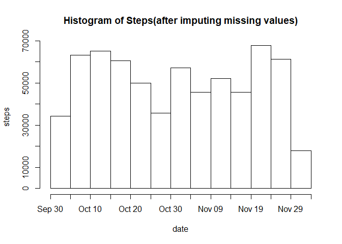
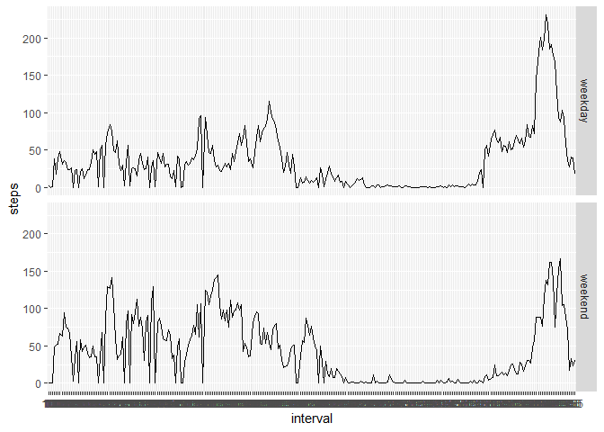

## Loading and preprocessing the data

```r
dt <- read.csv("activity.csv", header = T, stringsAsFactors = F, na.strings = "NA")
dt$date <- as.Date(dt$date, "%Y-%m-%d")
```


## What is mean total number of steps taken per day?
1. Calculate total number of steps taken per day.  

```r
tb <- tapply(dt$steps, dt$date, sum, na.rm = TRUE)
tb <- as.data.frame(tb)
df <- data.frame(date=row.names(tb), steps=(tb$tb))
df$date <- as.Date(df$date, "%Y-%m-%d")
df
```

```
##          date steps
## 1  2012-10-01     0
## 2  2012-10-02   126
## 3  2012-10-03 11352
## 4  2012-10-04 12116
## 5  2012-10-05 13294
## 6  2012-10-06 15420
## 7  2012-10-07 11015
## 8  2012-10-08     0
## 9  2012-10-09 12811
## 10 2012-10-10  9900
## 11 2012-10-11 10304
## 12 2012-10-12 17382
## 13 2012-10-13 12426
## 14 2012-10-14 15098
## 15 2012-10-15 10139
## 16 2012-10-16 15084
## 17 2012-10-17 13452
## 18 2012-10-18 10056
## 19 2012-10-19 11829
## 20 2012-10-20 10395
## 21 2012-10-21  8821
## 22 2012-10-22 13460
## 23 2012-10-23  8918
## 24 2012-10-24  8355
## 25 2012-10-25  2492
## 26 2012-10-26  6778
## 27 2012-10-27 10119
## 28 2012-10-28 11458
## 29 2012-10-29  5018
## 30 2012-10-30  9819
## 31 2012-10-31 15414
## 32 2012-11-01     0
## 33 2012-11-02 10600
## 34 2012-11-03 10571
## 35 2012-11-04     0
## 36 2012-11-05 10439
## 37 2012-11-06  8334
## 38 2012-11-07 12883
## 39 2012-11-08  3219
## 40 2012-11-09     0
## 41 2012-11-10     0
## 42 2012-11-11 12608
## 43 2012-11-12 10765
## 44 2012-11-13  7336
## 45 2012-11-14     0
## 46 2012-11-15    41
## 47 2012-11-16  5441
## 48 2012-11-17 14339
## 49 2012-11-18 15110
## 50 2012-11-19  8841
## 51 2012-11-20  4472
## 52 2012-11-21 12787
## 53 2012-11-22 20427
## 54 2012-11-23 21194
## 55 2012-11-24 14478
## 56 2012-11-25 11834
## 57 2012-11-26 11162
## 58 2012-11-27 13646
## 59 2012-11-28 10183
## 60 2012-11-29  7047
## 61 2012-11-30     0
```
2. Make a histogram of the total number of steps taken each day.  

```r
df.freq <- as.Date(as.vector(rep(df$date, df$steps)),origin = "1900-01-01")
hist(df.freq, breaks = 12, freq = T, main = "Histogram of Steps", ylab = "steps", xlab = "date")
```

<!-- -->

3. Calculate and report the mean and median of the total number of steps taken per day.  

```r
mn <- tapply(dt$steps, dt$date, mean, na.rm = T)
mn <- as.data.frame(mn)
medn <- tapply(dt$steps, dt$date, median, na.rm = T)
medn <- as.data.frame(medn)
stpdata <- data.frame(date=row.names(mn), mean = mn$mn, median = medn$medn)
stpdata
```

```
##          date       mean median
## 1  2012-10-01        NaN     NA
## 2  2012-10-02  0.4375000      0
## 3  2012-10-03 39.4166667      0
## 4  2012-10-04 42.0694444      0
## 5  2012-10-05 46.1597222      0
## 6  2012-10-06 53.5416667      0
## 7  2012-10-07 38.2465278      0
## 8  2012-10-08        NaN     NA
## 9  2012-10-09 44.4826389      0
## 10 2012-10-10 34.3750000      0
## 11 2012-10-11 35.7777778      0
## 12 2012-10-12 60.3541667      0
## 13 2012-10-13 43.1458333      0
## 14 2012-10-14 52.4236111      0
## 15 2012-10-15 35.2048611      0
## 16 2012-10-16 52.3750000      0
## 17 2012-10-17 46.7083333      0
## 18 2012-10-18 34.9166667      0
## 19 2012-10-19 41.0729167      0
## 20 2012-10-20 36.0937500      0
## 21 2012-10-21 30.6284722      0
## 22 2012-10-22 46.7361111      0
## 23 2012-10-23 30.9652778      0
## 24 2012-10-24 29.0104167      0
## 25 2012-10-25  8.6527778      0
## 26 2012-10-26 23.5347222      0
## 27 2012-10-27 35.1354167      0
## 28 2012-10-28 39.7847222      0
## 29 2012-10-29 17.4236111      0
## 30 2012-10-30 34.0937500      0
## 31 2012-10-31 53.5208333      0
## 32 2012-11-01        NaN     NA
## 33 2012-11-02 36.8055556      0
## 34 2012-11-03 36.7048611      0
## 35 2012-11-04        NaN     NA
## 36 2012-11-05 36.2465278      0
## 37 2012-11-06 28.9375000      0
## 38 2012-11-07 44.7326389      0
## 39 2012-11-08 11.1770833      0
## 40 2012-11-09        NaN     NA
## 41 2012-11-10        NaN     NA
## 42 2012-11-11 43.7777778      0
## 43 2012-11-12 37.3784722      0
## 44 2012-11-13 25.4722222      0
## 45 2012-11-14        NaN     NA
## 46 2012-11-15  0.1423611      0
## 47 2012-11-16 18.8923611      0
## 48 2012-11-17 49.7881944      0
## 49 2012-11-18 52.4652778      0
## 50 2012-11-19 30.6979167      0
## 51 2012-11-20 15.5277778      0
## 52 2012-11-21 44.3993056      0
## 53 2012-11-22 70.9270833      0
## 54 2012-11-23 73.5902778      0
## 55 2012-11-24 50.2708333      0
## 56 2012-11-25 41.0902778      0
## 57 2012-11-26 38.7569444      0
## 58 2012-11-27 47.3819444      0
## 59 2012-11-28 35.3576389      0
## 60 2012-11-29 24.4687500      0
## 61 2012-11-30        NaN     NA
```


## What is the average daily activity pattern?
1. Make a time series plot of the 5-minute interval and the average number of steps taken, averaged across all days.  

```r
interval_ave <- tapply(dt$steps, dt$interval, mean, na.rm = T)
plot(interval_ave, type = "l", main = "plot of steps by time interval", xlab = "time interval", ylab = "steps")
```

<!-- -->

2. Which 5-minute interval, on average across all the days in the dataset, contains the maximum number of steps?  

```r
interval_num <- names(interval_ave[match(max(interval_ave), interval_ave)])
```
**The interval 835 contains the maximum number of steps on average across all the days in the dataset.**  

## Imputing missing values

1. Calculate and report the total number of missing values in the dataset (i.e. the total number of rows with NAs.)  

```r
na_num <- sum(is.na(dt$steps))
```
**total number of missing values in the dataset is 2304**

2. Devise a strategy for filling in all of the missing values in the dataset. The strategy does not need to be sophisticated. For example, you could use the mean/median for that day, or the mean for that 5-minute interval, etc.  
The missing values will be filled with the average interval value calculated in `interval_ave`.  
3. Create a new dataset that is equal to the original dataset but with the missing data filled in.  
**Fill in the missing value:**  

```r
dt1 <- dt
for (i in 1:nrow(dt1)){
       if(is.na(dt1[i,1])){
              dt1[i,1] <- interval_ave[[match(dt1[i,3], names(interval_ave))]]
       }
}
head(dt1)
```

```
##       steps       date interval
## 1 1.7169811 2012-10-01        0
## 2 0.3396226 2012-10-01        5
## 3 0.1320755 2012-10-01       10
## 4 0.1509434 2012-10-01       15
## 5 0.0754717 2012-10-01       20
## 6 2.0943396 2012-10-01       25
```
4. Make a histogram of the total number of steps taken each day and Calculate and report the mean and median total number of steps taken per day. Do these values differ from the estimates from the first part of the assignment? What is the impact of imputing missing data on the estimates of the total daily number of steps?  
- Make a histogram of the total number of steps taken each day  

```r
tb1 <- tapply(dt1$steps, dt1$date, sum, na.rm = TRUE)
tb1 <- as.data.frame(tb1)
df1 <- data.frame(date=row.names(tb1), steps=(tb1$tb1))
df1$date <- as.Date(df1$date, "%Y-%m-%d")
df1.freq <- as.Date(as.vector(rep(df1$date, df1$steps)),origin = "1900-01-01")
hist(df1.freq, breaks = 12, freq = T, main = "Histogram of Steps(after imputing missing values)", ylab = "steps", xlab = "date")
```

<!-- -->

- Calculate and report the mean and median of total number of steps taken per day.  

```r
mn1 <- tapply(dt1$steps, dt1$date, mean, na.rm = T)
mn1 <- as.data.frame(mn1)
medn1 <- tapply(dt1$steps, dt1$date, median, na.rm = T)
medn1 <- as.data.frame(medn1)
stpdata1 <- data.frame(date=row.names(mn1), mean = mn1$mn1, median = medn1$medn1)
stpdata1
```

```
##          date       mean   median
## 1  2012-10-01 37.3825996 34.11321
## 2  2012-10-02  0.4375000  0.00000
## 3  2012-10-03 39.4166667  0.00000
## 4  2012-10-04 42.0694444  0.00000
## 5  2012-10-05 46.1597222  0.00000
## 6  2012-10-06 53.5416667  0.00000
## 7  2012-10-07 38.2465278  0.00000
## 8  2012-10-08 37.3825996 34.11321
## 9  2012-10-09 44.4826389  0.00000
## 10 2012-10-10 34.3750000  0.00000
## 11 2012-10-11 35.7777778  0.00000
## 12 2012-10-12 60.3541667  0.00000
## 13 2012-10-13 43.1458333  0.00000
## 14 2012-10-14 52.4236111  0.00000
## 15 2012-10-15 35.2048611  0.00000
## 16 2012-10-16 52.3750000  0.00000
## 17 2012-10-17 46.7083333  0.00000
## 18 2012-10-18 34.9166667  0.00000
## 19 2012-10-19 41.0729167  0.00000
## 20 2012-10-20 36.0937500  0.00000
## 21 2012-10-21 30.6284722  0.00000
## 22 2012-10-22 46.7361111  0.00000
## 23 2012-10-23 30.9652778  0.00000
## 24 2012-10-24 29.0104167  0.00000
## 25 2012-10-25  8.6527778  0.00000
## 26 2012-10-26 23.5347222  0.00000
## 27 2012-10-27 35.1354167  0.00000
## 28 2012-10-28 39.7847222  0.00000
## 29 2012-10-29 17.4236111  0.00000
## 30 2012-10-30 34.0937500  0.00000
## 31 2012-10-31 53.5208333  0.00000
## 32 2012-11-01 37.3825996 34.11321
## 33 2012-11-02 36.8055556  0.00000
## 34 2012-11-03 36.7048611  0.00000
## 35 2012-11-04 37.3825996 34.11321
## 36 2012-11-05 36.2465278  0.00000
## 37 2012-11-06 28.9375000  0.00000
## 38 2012-11-07 44.7326389  0.00000
## 39 2012-11-08 11.1770833  0.00000
## 40 2012-11-09 37.3825996 34.11321
## 41 2012-11-10 37.3825996 34.11321
## 42 2012-11-11 43.7777778  0.00000
## 43 2012-11-12 37.3784722  0.00000
## 44 2012-11-13 25.4722222  0.00000
## 45 2012-11-14 37.3825996 34.11321
## 46 2012-11-15  0.1423611  0.00000
## 47 2012-11-16 18.8923611  0.00000
## 48 2012-11-17 49.7881944  0.00000
## 49 2012-11-18 52.4652778  0.00000
## 50 2012-11-19 30.6979167  0.00000
## 51 2012-11-20 15.5277778  0.00000
## 52 2012-11-21 44.3993056  0.00000
## 53 2012-11-22 70.9270833  0.00000
## 54 2012-11-23 73.5902778  0.00000
## 55 2012-11-24 50.2708333  0.00000
## 56 2012-11-25 41.0902778  0.00000
## 57 2012-11-26 38.7569444  0.00000
## 58 2012-11-27 47.3819444  0.00000
## 59 2012-11-28 35.3576389  0.00000
## 60 2012-11-29 24.4687500  0.00000
## 61 2012-11-30 37.3825996 34.11321
```

**These values do not differ from the estimates from the first part of the assignment except for those days with all values missing, in which case the mean and median value calculated will be NaNs**  
## Are there differences in activity patterns between weekdays and weekends?
1. Create a new factor variable in the dataset with two levels – “weekday” and “weekend” indicating whether a given date is a weekday or weekend day.  

```r
dt1$day <- weekdays(dt1$date, T)
dt1$day[dt1$day == "Mon" |dt1$day == "Tue" |dt1$day == "Wed" |dt1$day == "Thu" |dt1$day == "Fri"] <- "weekday"
dt1$day[dt1$day == "Sat" | dt1$day == "Sun"] <- "weekend"
dt1$day <- as.factor(dt1$day)
```
2. Make a panel plot containing a time series plot of the 5-minute interval and the average number of steps taken, averaged across all weekday days or weekend days.   

```r
library(ggplot2)
library(reshape2)
interval_ave1 <- tapply(dt1$steps, list(dt1$interval,dt1$day), mean, na.rm = T)
intave <- as.data.frame(interval_ave1)
intave$interval <- row.names(intave)
intave <- melt(intave, id.vars = "interval", measure.vars = c("weekday", "weekend"), variable.name = "day", value.name = "steps")
a <- ggplot(intave, aes(interval, steps, group = day))
a +geom_line()+facet_grid(rows = vars(day))
```

<!-- -->


